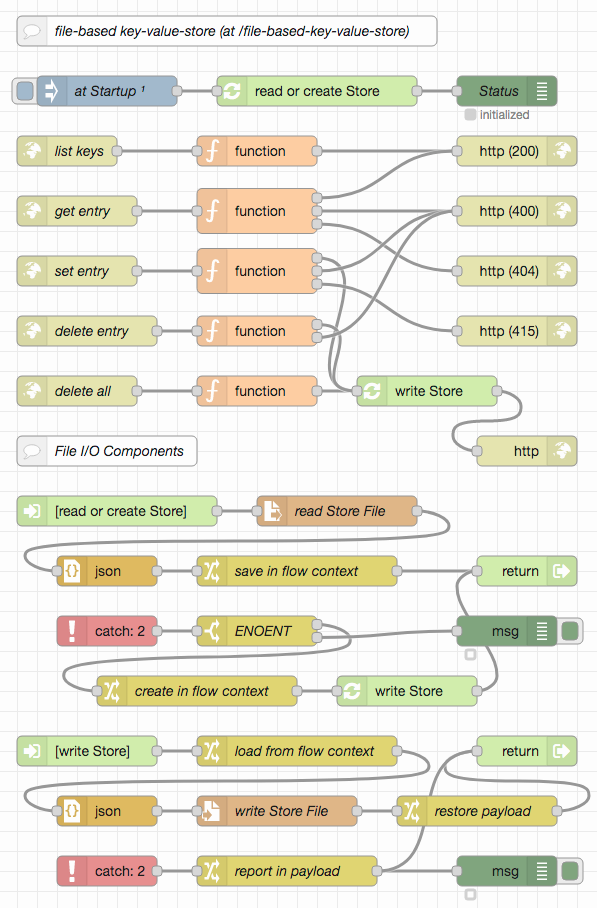

# node-red-rest-service-examples #

This collection of [Node-RED](https://nodered.org/) examples (with a matching [Postman](https://www.postman.com/) collection for testing) is mainly intended for my students, but parts of it may also be of more general interest.

It is the continuation of my other examples of [HTTP(S) endpoints](https://github.com/rozek/node-red-http-endpoint-examples) and [file-based web servers](https://github.com/rozek/node-red-web-server-examples) and explains how to implement some other basic REST services using Node-RED.

For this series, it is assumed that the reader already installed Node-RED (as described in [Getting Started](https://nodered.org/docs/getting-started/)), optionally secured the editor (as shown in [Securing Node-RED](https://nodered.org/docs/user-guide/runtime/securing-node-red)) and started using it (as explained in [Creating your first flow](https://nodered.org/docs/tutorials/first-flow))

> Please note: this work is currently in progress. While it may already be used, do not expect it to be finished before midth of October 2021.

> Just a small note: if you like this work and plan to use it, consider "starring" this repository (you will find the "Star" button on the top right of this page), so that I know which of my repositories to take most care of.

### Required Extensions ###

For these examples to be run, it is necessary to install the following extension:

* [node-red-contrib-reusable-flows](https://github.com/ollixx/node-red-contrib-reusable-flows) "Reusable Flows" allow multiply needed flows to be defined once and then invoked from multiple places

## Examples ##

All example specifications are stored in JSON format and may easily be imported into a Node-RED workspace. Preferrably, you should open a separate tab and insert them there.

To test the examples, a [Postman collection](https://raw.githubusercontent.com/rozek/node-red-rest-server-examples/main/PostmanCollection.json) is included, which may easily be imported into a running [Postman](https://www.postman.com/) instance. After the import, you should open the collection's "Variables" section and set the `BaseURL` to the base URL of your NodeRED instance (by default, it is set to `127.0.0.1:1880`, which should work out-of-the-box for most Node-RED installations). If your Node-RED instance has been configured to require basic authentication, you should also set the variables `Username` and `Password`)

Alternatively, other tools like [cURL](https://curl.se/) may be used as well.

## Key-Value Stores ##

"Key-Value Stores" behave a bit like dictionaries: you choose a key word and read or write an associated value. If your data can be indexed by such "keys" and you always handle data records (i.e., values) as a whole, key-value-stores are a convenient method to store such data.

There are a lot of professional key-value-stores, usually designed to handle large amounts of data efficiently and reliably, often able to distribute the whole data set among multiple nodes for better scalabality - but if you just need a small store for a few thousand keys and/or values with a size of up to approx. 1 MB, it may be simpler to implement that store in Node-RED itself.

The following examples show three different implementations:

* a "Memory-based Key-Value-Store" which does not write anything to disk,
* a "File-based Key-Value-Store" which keeps all data in a single file and
* a "Folder-based Key-Value-Store" which writes the value of each key into its own file within a hierarchical structure of folders. 

### Memory-based Key-Value-Store ###

In the simplest case, the whole key-value-store may just be kept in memory - knowing that all data is lost if the Node-RED server crashes or is restarted:

Currently, this service is accessible for everybody. But if you combine it with the authentication and authorization mechanisms from the [Node-RED Authorization Examples](https://github.com/rozek/node-red-authorization-examples), you may also easily create a *closed* Key-Value-Store.

### File-based Key-Value-Store ###

If the amount of data to be kept in a key-value-store is known to be small (let's say, less than perhaps 10MB) and does not change too often (let's say, less than once a second) it may be written into a single file whenever it changes:

The shown example reads from and writes to a file called `file-based-key-value-store.json` found in the working directory of the running Node-RED instance - if you want to change it, just update the nodes labelled `read Store File` and `write Store File`.

Currently, this service is accessible for everybody. But if you combine it with the authentication and authorization mechanisms from the [Node-RED Authorization Examples](https://github.com/rozek/node-red-authorization-examples), you may also easily create a *closed* Key-Value-Store.

## File Management ##

> For this example to work, a folder named `file-management` has to be created in the working directory of your Node-RED instance

## License ##

[MIT License](LICENSE.md)
