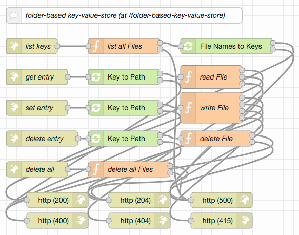
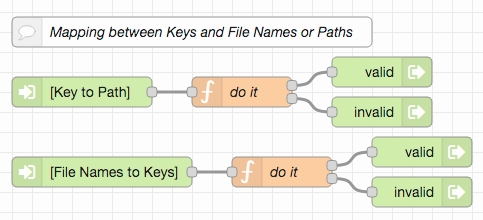
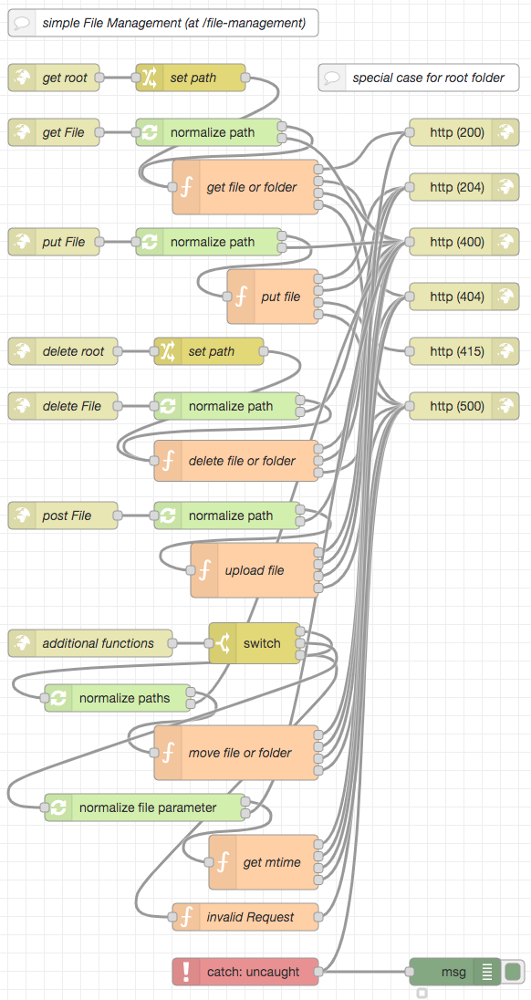
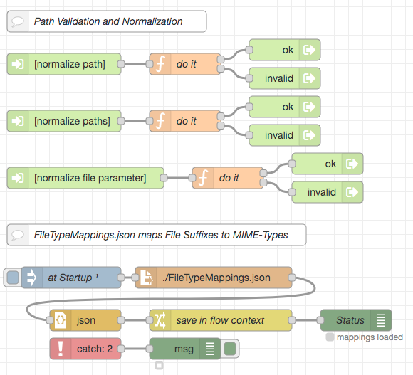

# node-red-rest-service-examples #

This collection of [Node-RED](https://nodered.org/) examples (with a matching [Postman](https://www.postman.com/) collection for testing) is mainly intended for my students, but parts of it may also be of more general interest.

It is the continuation of my other examples of [HTTP(S) endpoints](https://github.com/rozek/node-red-http-endpoint-examples) and [file-based web servers](https://github.com/rozek/node-red-web-server-examples) and explains how to implement some other basic REST services using Node-RED.

For this series, it is assumed that the reader already installed Node-RED (as described in [Getting Started](https://nodered.org/docs/getting-started/)), optionally secured the editor (as shown in [Securing Node-RED](https://nodered.org/docs/user-guide/runtime/securing-node-red)) and started using it (as explained in [Creating your first flow](https://nodered.org/docs/tutorials/first-flow))

> Just a small note: if you like this work and plan to use it, consider "starring" this repository (you will find the "Star" button on the top right of this page), so that I know which of my repositories to take most care of.

### Required Extensions ###

For these examples to be run, it is necessary to install the following extension:

* [node-red-contrib-reusable-flows](https://github.com/ollixx/node-red-contrib-reusable-flows) "Reusable Flows" allow multiply needed flows to be defined once and then invoked from multiple places

### Postman ###

Some of the examples described below can be tested more easily if you have [Postman](https://www.postman.com/) installed on your machine.

## Examples ##

All example specifications are stored in JSON format and may easily be imported into a Node-RED workspace. Preferrably, you should open a separate tab and insert them there.

To test the examples, a [Postman collection](https://raw.githubusercontent.com/rozek/node-red-rest-server-examples/main/PostmanCollection.json) is included, which may easily be imported into a running [Postman](https://www.postman.com/) instance. After the import, you should open the collection's "Variables" section and set the `BaseURL` to the base URL of your NodeRED instance (by default, it is set to `127.0.0.1:1880`, which should work out-of-the-box for most Node-RED installations). If your Node-RED instance has been configured to require basic authentication, you should also set the variables `Username` and `Password`)

Alternatively, other tools like [cURL](https://curl.se/) may be used as well.

## Key-Value Stores ##

"Key-Value Stores" behave a bit like dictionaries: you choose a key word and read or write an associated value. If your data can be indexed by such "keys" and you always handle data records (i.e., values) as a whole, key-value-stores are a convenient method to store such data.

There is currently a whole range of professional key-value-stores, usually designed to handle large amounts of data efficiently and reliably, often able to distribute the whole data set among multiple nodes for better scalabality - but if you just need a small store for a few thousand keys and/or values with a size of up to approx. 1 MB each, it may be simpler to implement that store in Node-RED itself.

The following examples show three different implementations:

* a "Memory-based Key-Value-Store" which does not write anything to disk,
* a "File-based Key-Value-Store" which keeps all data in a single file and
* a "Folder-based Key-Value-Store" which writes the value of each key into its own file within a hierarchical structure of folders. 

### Memory-based Key-Value-Store ###

In the simplest case, the whole key-value-store may just be kept in memory - knowing that all data is lost if the Node-RED server crashes or is restarted:

Currently, this service is accessible for everybody. But if you combine it with the authentication and authorization mechanisms from the [Node-RED Authorization Examples](https://github.com/rozek/node-red-authorization-examples), you may also easily create a *closed* Key-Value-Store.

In order to use this store, simply import its [flow](examples/memory-based-key-value-store.json) into your Node-RED workspace and deploy.

#### How to use the Store ####

As shown in the flow, all fundamental operations of a Key-Value Store are implemented as HTTP endpoints

* **list the keys of all stored entries** `GET memory-based-key-value-store/` returns a JSON document containing a (possibly empty) array with the keys of all entries found in the store
* **retrieve the value of a specific entry** `GET memory-based-key-value-store/<key>` returns a text document containg the value of a store entry identified by the "key" given in the request URL - provided that such an entry exists, otherwise the server just responds with status code 404 ("Not Found"). In this example, keys must be less than 256 characters long, and values will contain less than 10242 characters (but this may be changed by modifying the functions found in the flow)
* **set the value of a specific entry** `SET memory-based-key-value-store/<key>` expects the request body to contain a text document with the value the store entry identified by the "key" given in the request URL should be set to. If such an entry does not yet exist, it will be created - otherwise the previously stored value will be overwritten. In this example, keys must be less than 256 characters long, values less than 10242 characters (but this may be changed by modifying the functions found in the flow)
* **delete a specific entry** `DELETE memory-based-key-value-store/<key>` removes the entry identified by the "key" given in the request URL from the store - provided that such an entry exists, otherwise the request will simply be ignored (it is therefore safe to delete non-existing entries)
* **delete all entries** `DELETE memory-based-key-value-store` removes all currently stored entries from the store - provided that the store is not empty, otherwise the request will simply be ignored (it is therefore safe to clear an empty store)

For experimentation purposes, you may import the [Postman collection](PostmanCollection.json) that comes with this repository and use the predefined requests for this store.

### File-based Key-Value-Store ###

If the total size of all data to be kept in a key-value-store is known to be small (let's say, less than perhaps 10MB) and does not change too often (let's say, less than once a second) it may be written into a single file whenever it changes:

The shown example reads from and writes to a file called `file-based-key-value-store.json` found in the working directory of the running Node-RED instance - if you want to change it, just update the nodes labelled `read Store File` and `write Store File`.

Currently, this service is accessible for everybody. But if you combine it with the authentication and authorization mechanisms from the [Node-RED Authorization Examples](https://github.com/rozek/node-red-authorization-examples), you may also easily create a *closed* Key-Value-Store.

In order to use this store, simply import its [flow](examples/file-based-key-value-store.json) into your Node-RED workspace and deploy.

#### How to use the Store ####

As shown in the flow, all fundamental operations of a Key-Value Store are implemented as HTTP endpoints

* **list the keys of all stored entries** `GET file-based-key-value-store/` returns a JSON document containing a (possibly empty) array with the keys of all entries found in the store
* **retrieve the value of a specific entry** `GET file-based-key-value-store/<key>` returns a text document containg the value of a store entry identified by the "key" given in the request URL - provided that such an entry exists, otherwise the server just responds with status code 404 ("Not Found"). In this example, keys must be less than 256 characters long, and values will contain less than 10242 characters (but this may be changed by modifying the functions found in the flow)
* **set the value of a specific entry** `SET file-based-key-value-store/<key>` expects the request body to contain a text document with the value the store entry identified by the "key" given in the request URL should be set to. If such an entry does not yet exist, it will be created - otherwise the previously stored value will be overwritten. In this example, keys must be less than 256 characters long, values less than 10242 characters (but this may be changed by modifying the functions found in the flow)
* **delete a specific entry** `DELETE file-based-key-value-store/<key>` removes the entry identified by the "key" given in the request URL from the store - provided that such an entry exists, otherwise the request will simply be ignored (it is therefore safe to delete non-existing entries)
* **delete all entries** `DELETE file-based-key-value-store` removes all currently stored entries from the store - provided that the store is not empty, otherwise the request will simply be ignored (it is therefore safe to clear an empty store)

For experimentation purposes, you may import the [Postman collection](PostmanCollection.json) that comes with this repository and use the predefined requests for this store.

### Folder-based Key-Value-Store ###

If the total size of all data to be kept in a key-value-store is expected to exceed 10 MB, it may be useful to give the value of each key its own file. Since managing folders with large numbers of files may become difficult, these files should be organized into a hierarchical set of folders. This structure and the fact that the permitted keys may not be directly used as file names makes it necessary to provide an explicit mapping from a store key to the path of a value file.

The following example assumes "universally unique identifiers" (UUIDs) of type 4 as keys (and file names) and uses the last three hexadecimal digits to route these keys into one of 16\*16\*16 = 212 = 4096 folders. Assuming that all used keys are equally distributed, a set of 220 (i.e., more than one million) keys will therefore result in 4096 folders containing approx. 28 = 256 files each.

If you plan to use a different type of keys (rather than UUIDs), you will have to modify nodes "Key to Path" and "File Names to Keys" accordingly:

If you need to generate new UUIDs you may either use an [online UUID generator](https://www.uuidgenerator.net/version4) or the function that comes with this example:

In order to use this store, simply import its [flow](examples/folder-based-key-value-store.json) into your Node-RED workspace and deploy.

#### How to use the Store ####

As shown in the flow, all fundamental operations of a Key-Value Store are implemented as HTTP endpoints

* **list the keys of all stored entries** `GET folder-based-key-value-store/` returns a JSON document containing a (possibly empty) array with the UUIDs of all entries found in the store
* **retrieve the value of a specific entry** `GET folder-based-key-value-store/<uuid>` returns a text document containg the value of a store entry identified by the "uuid" given in the request URL - provided that such an entry exists, otherwise the server just responds with status code 404 ("Not Found"). In this example, values will be less than 10242 characters long (but this may be changed by modifying the functions found in the flow)
* **set the value of a specific entry** `SET folder-based-key-value-store/<uuid>` expects the request body to contain a text document with the value the store entry identified by the "uuid" given in the request URL should be set to. If such an entry does not yet exist, it will be created - otherwise the previously stored value will be overwritten. In this example, values must be less than 10242 characters long (but this may be changed by modifying the functions found in the flow)
* **delete a specific entry** `DELETE folder-based-key-value-store/<uuid>` removes the entry identified by the "uuid" given in the request URL from the store - provided that such an entry exists, otherwise the request will simply be ignored (it is therefore safe to delete non-existing entries)
* **delete all entries** `DELETE folder-based-key-value-store` removes all currently stored entries from the store - provided that the store is not empty, otherwise the request will simply be ignored (it is therefore safe to clear an empty store)

For experimentation purposes, you may import the [Postman collection](PostmanCollection.json) that comes with this repository and use the predefined requests for this store.

## Simple File Management ##

Sometimes it is desirable to manage the files on a server from remote, e.g. using a web interface. While there are professional solutions such as ftp or WebDAV, it is not always possible to install such servers alongside a Node-RED instance.

In such situations, the following example may be helpful which offers the following features:

* directory inspection (file name listing),
* file upload and download with automatic directory creation and
* file and directory removal

File inspection (including timestamps and size information) is not yet implemented (but could be added if needed)

In order to use this store, simply import its [flow](examples/file-management.json) into your Node-RED workspace and deploy.

> For this example to work, a folder named `file-management` has to be created in the working directory of your Node-RED instance.

#### How to manage Files ####

As shown in the flow, all provided operations are implemented as HTTP endpoints

* **inspect a folder** `GET file-management/<path>` if the "path" given in the request URL points to a directory, the server returns a JSON document containing a (possibly empty) array with the names of all files and folders found in that directory. Folder names will be suffixed with a slash `/` in order to mark them as such, file names are not. If neither a file nor a directory exist at the given path, the server responds with status code 404 ("Not Found"), if the path points to a file, the contents of that file are returned (see below)
* **read a file** `GET file-management/<path>` if the "path" given in the request URL points to a file, the server returns a document with the contents of that file. The MIME type of that document will depend on the file name suffix: file names ending with `.txt` will result in documents of type `text/plain`, names ending with `.png` in those of type `image/png` etc.. If neither a file nor a directory exist at the given path, the server responds with status code 404 ("Not Found"), if the path points to a directory, a list with the names of all files and folders in that directory is returned (see above)
* **write a file** `PUT file-management/<path>` expects the request body to contain a document whose contents are written into a file given by the "path" found in the request URL. If such a file does not yet exist, it will be created (if need be, together with all outer folders required to reach that file) otherwise the existing file will be overwritten. If the "path" given in the request URL points to a directory, the request will fail. The MIME type of the sent document must match the server's expectation based on the file's name suffix: file names ending with `.txt` will expect documents of type `text/plain`, names ending with `.png` documents of type `image/png` etc.
* **upload a file** `POST file-management/<path>` expects the request body to contain a form describing a file upload. The first uploaded file will then be written into the file given by the "path" found in the request URL. If such a file does not yet exist, it will be created (if need be, together with all outer folders required to reach that file) otherwise the existing file will be overwritten. If the "path" given in the request URL points to a directory, the request will fail. The MIME type of the uploaded file must match the server's expectation based on the file's name suffix: file names ending with `.txt` will expect uploads of type `text/plain`, names ending with `.png` uploads of type `image/png` etc.
* **delete a folder** `DELETE file-management/<path>` if the "path" given in the request URL points to a directory, that directory is deleted - together with all the files and folders it contains. It is safe to delete a non-existing directory
* **delete a file** `DELETE file-management/<path>` if the "path" given in the request URL points to a file, that file is deleted. It is safe to delete a non-existing file

For experimentation purposes, you may import the [Postman collection](PostmanCollection.json) that comes with this repository and use the predefined requests for this store. Before, you should also copy the example files which come with this repository (found in directory [file-management](https://github.com/rozek/node-red-rest-service-examples/tree/main/file-management)) into that folder. Additionally, in order to test the file upload, you will have to point the related Postman request to the file that is to be uploaded - simply select file `image-file.png` from the example files.

## License ##

[MIT License](LICENSE.md)
